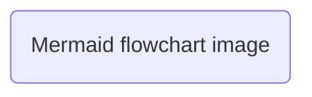
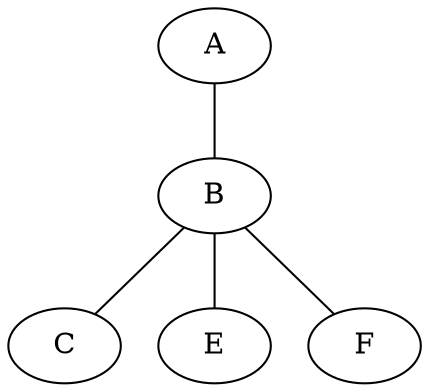

---
config: [<configfile>|None]
output:
  name : [<filename>|None]
  style: [raw|Markdown|HTML|LaTeX|Beamer]
  format: [txt|md|html|tex|pdf]
# semantic: txt accepts all styles, md accepts both raw and Markdown styles,
# html only accepts HTML style, tex accepts both LaTeX and Beamer styles and
# pdf accepts HTML LaTeX and Beamer styles
export-preference: [zip|tar|tgz|g7]
markdown:
  style: [Original|MultiMarkdown|GFM|pandoc|CommonMark|Extra]
  indent:
    lenght: [2|4|8]
    type: [soft|hard]
  newline: [LF|CRLF]
add-ons:
  jinja2: [enabled|disabled]
  toc:
  titles numerotation:
  foot-notes:

...

# Markdown

## Comment

<!-- one line comment -->

<!-- multi
line
comment -->

## Paragraph

* first line indented
* first line not indented

## List

* bullet list
```
* first style
+ second style
- third style
```
* linear numbered list
```
1.
2.
```
* constant numbered list
```
1.
1.
```
* task list
```
- [ ] first style
- [x] first style
+ [ ] second style
+ [x] second style
* [ ] third style
* [x] third style
```

## Formatting

**bold**, __underscore bold__, *italic*, _underscore italic_, ^superscript^, ~subscript~, ==highlight==, ~~strike-through~~, `in line code`, $in\ line\ \LaTeX$

<u>html tag underline</u> _underscore underline_

## Block

```
code block without syntax highlight
```

```python
def hello():
    print("code block with syntax highlight")

if __name__ == '__main__':
	hello()
```

	indented code block

```=
code block with line numeration
```

```$
code block with line marker
```

$$
\LaTeX\ block
$$

* block numeration
* line marker: numeration, character (`$`, `#` or `>`), none

## Quotation

> Quote

## Table

| Header 1 | Header 2 |
| -------- | -------- |
| col 1    | col 2    |

| Left aligned |  Centered   | Right aligned |
| :----------- | :---------: | ------------: |
| row 1 col 1  | row 1 col 2 |   row 1 col 3 |
| row 2 col 1  | row 2 col 2 |   row 2 col 3 |

|       |        |
| ----- | ------ |
| table | with   |
| no    | header |

| Single         | cell         | alignement      |
| -------------- | ------------ | --------------- |
| : left aligned | : centered : | right aligned : |

| Merged headers                                      |||
| ------------------| --------------- | --------------- |
| multiline row 1   | multiline row 1 | multiline row 1 \
| multiline row 2   | multiline row 2 | multiline row 2 |
| vertically merged | horizontally merged              ||
| ^^ second line    |                 |                 |

* Table numeration
* Table description (before or after)
* Table cell width variation with same rendered output
* Top / center / bottom vertical alignment
* Set column width / row hight
* Other Jekyll spaceship table features
* Table rotation

## Image

* File image






```latex
\usepackage{tikz}
% \usetikzlibrary{exampe}
% \newcommand{example}
\begin{tikzpicture} 
\draw (0,0) -- (1,0); 
\draw (0,0) -- (0,1); 
\end{tikzpicture}
```

```latex
```

* LaTex: Pgfpots

* Tikz extensions

  * tikzplotlib

  * matlab2tikz

  * blend2tikz


* Use the image's description as legend and as alt text

* Change image size with `{width=40%}` or `{height=60px}`
* Control image position with LaTeX tags `[htbp!]` for *here*, *top*, *bottom*, *page* and *override*, add `[crl]` for *center*, *left* and *right*

## Headers

* atx style:
```
# header 1
```
* atx suffix style:
```
# header 1 #
```
* setext style:
```
header 1
========
```
* variable setext style:
```
header 1
===
```

# Add-ons

## Table of contents

[toc]

[toc]

## Title numeration

## Foot notes

## Pages

## Bibliography
